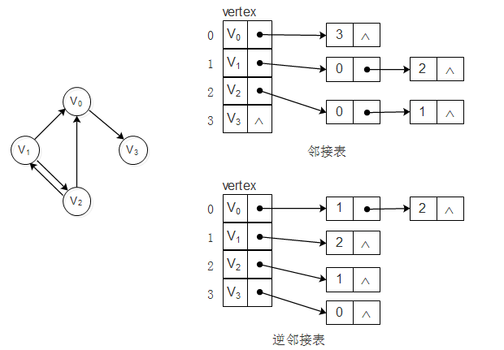
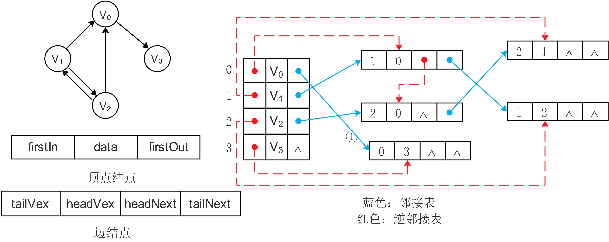

#### 图 ####

图感觉是数据结构里面最复杂的。。。。所以只讲一些基本的算法。

首先是图的基本概念。图是一个二元组 $G(V,E)$，其中 $V$ 为顶点集，$E$ 为边集。它们亦可写成 $V(G)$ 和 $E(G)$。 $E$ 的元素是一个二元组数对，用 $(x,y)$ 表示，其中 $(x,y) \in{V}$。

一个图如果：

1. 没有两条边，它们所关联的两个点都相同（在*有向图*中，没有两条边的起点终点都分别相同）
2. 每条边所关联的是两个不同的顶点

则称为简单图。简单的有向图和无向图都可以使用以上“二元组”的定义，但形如 $(x,x)$ 的序对不能属于 $E$。而无向图的边集必须是对称的，即如果 $(x,y) \in E$ 那么 $(y,x) \in E$ 。（我们只讨论简单图，若允许两顶点间的边数多于一条，又允许顶点通过同一条边和自己关联，则为*多重图*。它只能用“三元组”的定义）

首先将图的存储结构（程序表示方式）。图的存储结构有三种：邻接矩阵、领接表和十字链表。无论在哪一种存储结构中都存在一个一位数组（顶点数组）存储图中的每个顶点的信息。

**邻接矩阵**是一个二维矩阵 $M$ ，对于其中的每个非零单元 $M[a][b]$ 都保存一条从 $A$ 点到 $B$ 点的边的信息（或者是权重、由于权值可能为0所以无穷大表示边不存在，或者是0表示边存在、1表示不存在），其中，$a$ 、$b$ 分别为 $A$ 点和 $B$ 点在顶点数组中的索引。无向图由于边不区分方向，所以其邻接矩阵是一个对称矩阵。

邻接矩阵的优点是结构简单、操作方便；缺点是对于稀疏图，这种存储结构需要大量的空间。

**邻接表**是一种将数组与链表相结合的存储方法。其具体实现为：在顶点数组的每个单元中保留一个域用来指向一个保存了所有以该单元为起点（终点）的边的终点（起点）的单向链表：

又分为邻接表和逆邻接表。在邻接表中可以很容易地求得一个顶点的出度（以其为起点的边的条数），即对应链表的长度。但如果需要求入度仍需遍历整个图才行。逆邻接表则相反。

**十字链表**是将邻接表和逆邻接表相结合的存储方法。它解决了邻接表（逆邻接表）求入度（或出度）时需遍历整个图的缺陷：

相当于将邻接表和逆邻接表中的每种节点拼凑在一起，其中：

- firstIn表示入边表（即是逆邻接表中的单链表）头指针，firstOut表示出边表（即是邻接表中的单链表）头指针，data表示顶点数据。
- tailVex表示边的起点在顶点数组中的下标，tailNext值出边表指针域，指向起点相同的下一条边。
- headVex表示边的终点在顶点数组中的下标，headNext指入边表指针域，指向终点相同的下一条边。

每个边节点代表一条以tailVex表示的顶点为起点、以headVex表示的顶点为终点的边。其中可以加入一些其它的域来表示边的属性。加入节点的操作的复杂度为常数。

***********************

图的一个最基本的问题就是遍历。图的最基本的遍历算法有两个：深度优先搜索（DFS）和广度优先搜索（BFS）。

##### 深度优先搜索 #####

图的深度优先搜索(Depth First Search)，和树的先序遍历比较类似。

深度优先搜索假设初始状态所有顶点都没有被访问，则从某个顶点v出发，首先访问该顶点，然后依次按照一条（方便或随机的）路径访问其相邻节点（v -> v的相邻节点 -> v的相邻节点的相邻节点 ......），直到访问完该路径上的所有节点。若此时有其他节点没有访问到，则选择一个没有访问到的节点为新的起始顶点继续上述访问行为。直到所有节点都被访问为止。

实现：可以用递归实现，也可以用栈操作来实现回溯。（主要麻烦的点是记录在一条访问路径上与某一节点相邻的没有访问到的节点，见 MaxAreaOfIsland）

##### 广度优先搜索 #####

广度优先搜索算法(Breadth First Search)，又称为"宽度优先搜索"或"横向优先搜索"，简称BFS。

广度优先搜索假设初始状态所有节点都没有被访问，从某个顶点v出发，在访问完v之后依次访问v的各个未被访问的邻节点，然后从分别这些邻节点出发依次访问它们的未被访问的邻节点，并使得“先被访问的顶点的邻节点先于后被访问的顶点的邻节点被访问”，直到图中所有已被访问的顶点的邻节点都被访问到。如果此时图中尚有顶点未被访问到，则需要选择另一个未曾被访问到的顶点作为新的起始点。重复上述过程，直到图中所有顶点都被访问到为止。

实现：用递归或者队列来实现，跟树的广度优先搜索相似。

> PS：都需要把访问过的节点标记为已访问。这两个算法既适用于简单图也适用于多重图

