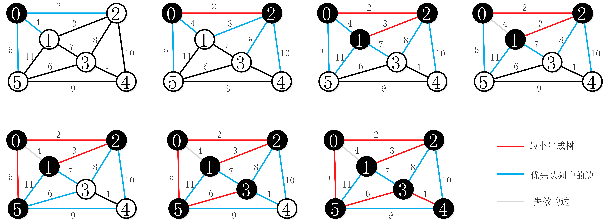
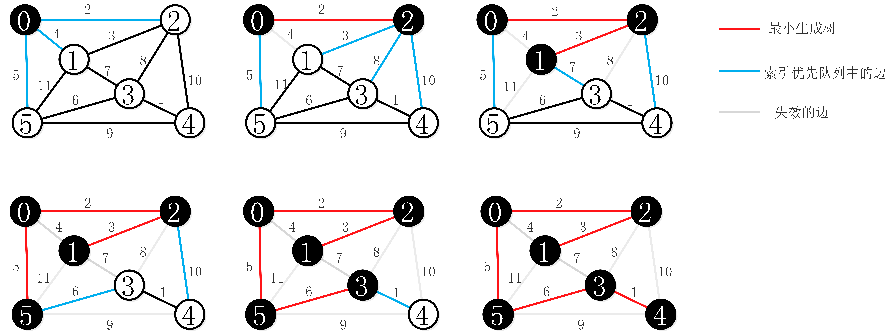
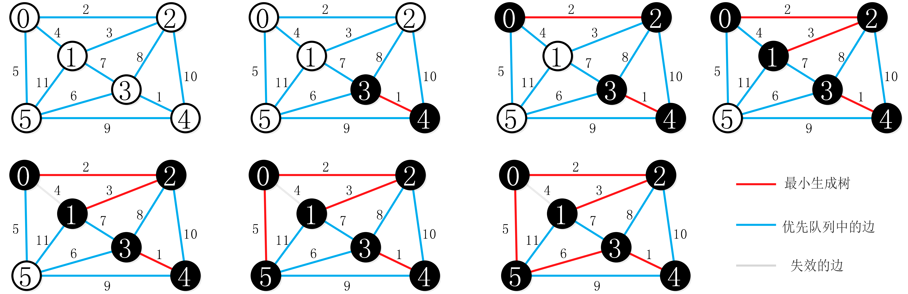

#### 图 ####

图感觉是数据结构里面最复杂的。。。。所以只讲一些基本的算法。

首先是图的基本概念。图是一个二元组 $G(V,E)$，其中 $V$ 为顶点集，$E$ 为边集。它们亦可写成 $V(G)$ 和 $E(G)$。 $E$ 的元素是一个二元组数对，用 $(x,y)$ 表示，其中 $(x,y) \in{V}$。

一个图如果：

1. 没有两条边，它们所关联的两个点都相同（在*有向图*中，没有两条边的起点终点都分别相同）
2. 每条边所关联的是两个不同的顶点

则称为简单图。简单的有向图和无向图都可以使用以上“二元组”的定义，但形如 $(x,x)$ 的序对不能属于 $E$。而无向图的边集必须是对称的，即如果 $(x,y) \in E$ 那么 $(y,x) \in E$ 。（我们只讨论简单图，若允许两顶点间的边数多于一条，又允许顶点通过同一条边和自己关联，则为*多重图*。它只能用“三元组”的定义）

首先将图的存储结构（程序表示方式）。图的存储结构有三种：邻接矩阵、领接表和十字链表。无论在哪一种存储结构中都存在一个一位数组（顶点数组）存储图中的每个顶点的信息。

**邻接矩阵**是一个二维矩阵 $M$ ，对于其中的每个非零单元 $M[a][b]$ 都保存一条从 $A$ 点到 $B$ 点的边的信息（或者是权重、由于权值可能为0所以无穷大表示边不存在，或者是0表示边存在、1表示不存在），其中，$a$ 、$b$ 分别为 $A$ 点和 $B$ 点在顶点数组中的索引。无向图由于边不区分方向，所以其邻接矩阵是一个对称矩阵。

邻接矩阵的优点是结构简单、操作方便；缺点是对于稀疏图，这种存储结构需要大量的空间。

**邻接表**是一种将数组与链表相结合的存储方法。其具体实现为：在顶点数组的每个单元中保留一个域用来指向一个保存了所有以该单元为起点（终点）的边的终点（起点）的单向链表：


又分为邻接表和逆邻接表。在邻接表中可以很容易地求得一个顶点的出度（以其为起点的边的条数），即对应链表的长度。但如果需要求入度仍需遍历整个图才行。逆邻接表则相反。

**十字链表**是将邻接表和逆邻接表相结合的存储方法。它解决了邻接表（逆邻接表）求入度（或出度）时需遍历整个图的缺陷：


相当于将邻接表和逆邻接表中的每种节点拼凑在一起，其中：

- firstIn表示入边表（即是逆邻接表中的单链表）头指针，firstOut表示出边表（即是邻接表中的单链表）头指针，data表示顶点数据。
- tailVex表示边的起点在顶点数组中的下标，tailNext值出边表指针域，指向起点相同的下一条边。
- headVex表示边的终点在顶点数组中的下标，headNext指入边表指针域，指向终点相同的下一条边。

每个边节点代表一条以tailVex表示的顶点为起点、以headVex表示的顶点为终点的边。其中可以加入一些其它的域来表示边的属性。加入节点的操作的复杂度为常数。领接表和十字链表的空间复杂度为 O($|V| + |E|$)，邻接矩阵的空间复杂度为 O($|V|^2$)。

***********************

图的一个最基本的问题就是遍历。图的最基本的遍历算法有两个：深度优先搜索（DFS）和广度优先搜索（BFS）。

##### 深度优先搜索 #####

图的深度优先搜索(Depth First Search)，和树的先序遍历比较类似。

深度优先搜索假设初始状态所有顶点都没有被访问，则从某个顶点v出发，首先访问该顶点，然后依次按照一条（方便或随机的）路径访问其相邻节点（v -> v的相邻节点 -> v的相邻节点的相邻节点 ......），直到访问完该路径上的所有节点。若此时有其他节点没有访问到，则选择一个没有访问到的节点为新的起始顶点继续上述访问行为。直到所有节点都被访问为止。

在DFS遍历的过程中，一条到达一个未访问到的顶点的边为 tree edge，所有的 tree edge 以及其到达的顶点构成了一棵树（以当前起始顶点为根）。从树中的某个顶点到达其在书中的先祖顶点（相同根顶点树中已经访问过的顶点）的边为 backward edge，到达其后代顶点的边为 forward edge（可以用一个counter来完成），其他边叫做 cross edge。cross edge 和 forward edge 在遍历无向图时不存在。DFS可以用来**查看图是否有环**，这意味着它一定存在一条 backward edge。深度优先也经常用来实现拓扑排序（见下面）。

实现：可以用递归实现，即不断地以不同的顶点为起始节点开始，直到所有顶点都被访问到；可以用栈操作来实现回溯。（主要麻烦的点是记录在一条访问路径上与某一节点相邻的没有访问到的节点，见 MaxAreaOfIsland）

```
//DFS的递归实现
//一次DFS，vertice为起始顶点
visited = {}
DFS_visit(vertice):
	visit(vertice)
	visited[v] = 1
	for v in next_vertices:
		if !visited[v]:
			DFS_visit(v)
		
//DFS
DFS(G):
	for vertice in G:
		if !visited[vertice]:
			DFS_visit(vertice)
```

##### 广度优先搜索 #####

广度优先搜索算法(Breadth First Search)，又称为"宽度优先搜索"或"横向优先搜索"，简称BFS。

广度优先搜索假设初始状态所有节点都没有被访问，从某个顶点v出发，在访问完v之后依次访问v的各个未被访问的邻节点，然后从分别这些邻节点出发依次访问它们的未被访问的邻节点，并使得“先被访问的顶点的邻节点先于后被访问的顶点的邻节点被访问”，直到图中所有已被访问的顶点的邻节点都被访问到。如果此时图中尚有顶点未被访问到，则需要选择另一个未曾被访问到的顶点作为新的起始点。重复上述过程，直到图中所有顶点都被访问到为止。广度优先搜索中，起始顶点到每个顶点的访问路径即从起始顶点到该顶点的**最短路径** （意味着经过的边最少，而不是权重和最小）。（可以通过记录每个顶点的父节点来记录最短路径）。

 实现：用递归或者队列来实现，跟树的广度优先搜索相似。

> PS：都需要把访问过的节点标记为已访问。这两个算法既适用于简单图也适用于多重图

********

##### 拓扑排序 #####

对于一个有向无环图 $G(V,E)$ ，其拓扑排序是 $G$ 中所有顶点的一种线性次序，该次序满足如下条件：如果图 $G$ 包含边 $(u,v)$ ，则顶点 $u$ 在拓扑排序中处于节点 $v$ 的前面（如果图 $G$ 包含环路，则不可能排出一个线性次序）。可以将图的拓扑排序看作是将图的所有节点在一条水平线上展开，图的所有有向边都从左指向右。拓扑排序一般用于事件的优先次序排序（事件调度）。

深度优先搜索可以用来对有向无环图进行拓扑排序。只需要用DFS遍历整个图，并在DFS_visit结束时将每个顶点push到一个栈中，然后全部出栈，即可以得到图的拓扑排序。（DFS_visit完成的先后顺序的逆序）

另一种实现拓扑排序的方法是，找出图中任意一个入度为0的顶点，然后输出该顶点，并将它和它的边一起从图中删除。然后，将其邻接的顶点的入度减去1 。然后重复上述过程直到所有顶点被完全删除。这种方法的缺点是每次都需要遍历所有的顶点来选择入度为0的顶点，所以算法复杂度是 O($n$) 的，优化策略是，首先将所有入度为0的顶点都压入某个栈，然后出栈，将其所有邻接节点的入度减去1，如果某个邻接顶点的入度此时为0，那么将其入栈。重复上述操作直到栈空。优化后的算法复杂度是 O($n$) 的。

> PS：第二种拓扑排序也可以用来检测图中是否有环，如果最后还有未删顶点，则存在环，否则没有环。

##### 强连通分量 #####

将有向图分解为强连通分量也是是DFS的一个经典应用。有向图 $G=(V,E)$ 的强连通分量是一个最大节点集合 $C\subseteqq{V}$ 对于该集合中的任意一对节点 $u$ 和 $v$ 来说，路径 $u\to v$ 和路径 $v\to u$ 同时存在；也就是说，顶点 $u$ 和顶点 $v$ 可以互相到达。（在无向图中，即为连通子图）

对于一个无向图的连通分量，从连通分量的任意一个顶点开始，进行一次DFS，一定能遍历这个连通分量的所有顶点。所以，整个图的连通分量数应该等价于遍历了整个图几次（最外层的）DFS。一次DFS中遍历的所有顶点属于同一个连通分量。

对于有向图来说情况要复杂些。我们可以采用**Kosaraju算法**来将一个有向图分解成一些强连通分量。

Kosaraju算法需要用到两次DFS，基本方法为：第一次DFS记录下各顶点完成搜索的时间（这里的完成时间是一次DFS_visit该顶点的全局完成时间，意味着其可达子顶点都被访问完毕），然后转置该图（将图中每一条边的方向反过来），然后按照第一次DFS记录下的完成时间的顶点的降序DFS遍历转置图（如果第一次DFS中存在顶点 $s$ 到顶点 $v$ 的路径，那么 $s$ 的完成时间肯定要大于 $v$），此时每次DFS即可以得到一个强连通分量（如果在转置图中一次DFS可以从 $s$ 到达 $v$ 那么 $s$ 和 $v$ 肯定是强连通的）。该算法对于邻接表的时间复杂度为 O($V+E$)，对于邻接矩阵复杂度为 O($V^2$)。算法时间复杂度较高。

强连通分量算法还有：Tarjan算法和Gabow算法。

********

##### 最小生成树算法 #####

> PS：从这里开始我们要接触的图中，每一条边都带有其权重（weight）。

图的生成树是它的一棵含有*所有顶点*的无环连通子图。一棵加权图的最小生成树（MST）是它的一棵权值（所有边的权值之和）最小的生成树。（只对于无向图）

> PS：连通图：在无向图中，若任意两个顶点vi与vj都有路径相通，则称该无向图为连通图。

计算最小生成树可能遇到的情况：

- 非连通的无向图，不存在最小生成树
- 权重不一定和距离成正比
- 权重可能是0或负数
- 若存在相等的权重，那么最小生成树可能不唯一

首先我们要知道**切分定理**：图的切分是将图的所有顶点分为两个非空且不重叠的两个集合。横切边是一条连接两个属于不同集合的顶点的边；而在一幅加权图中，给定任意的切分，它的横切边中的权重最小者必然属于图的最小生成树。

切分定理是解决最小生成树问题的所有算法的基础。*这些算法都是贪心算法*。

**Prim算法**：每次将权值最小的横切边加入生成树中。

Prim算法的**延时实现**的基本思路是：从任意顶点为开始，首先将该顶点加入生成树的顶点集合（该顶点为生成树的根），并将该集合与图中另外顶点组成的集合的所有横切边（相邻边）加入一个最小优先队列中。然后出队列，将队列中的最小权重的边加入生成树中。然后将该边对应的下一个顶点加入生成树顶点集合，并将该集合与图中另外顶点组成的集合的所有横切边加入生成树（即加入与新加入节点相邻并且另外一个端点不在已访问的顶点集合内的边，去掉两端点都在已访问的顶点集合中的边；另一种思路是加入一个顶点就把它的所有连接着未访问顶点的邻边都加入队列，出队列时判断边的两端点是否已经在生成树中，是则忽略）。然后出队列。不断重复上述操作直到队列为空（所有的顶点都被访问）。



因为队列操作为 O($\lg{n}$)，所以算法时间复杂度为 O($E\log{E}$)，空间复杂度为 O($E$)。

因为延时实现中*保存了大量失效的边*，我们可以继续对Prim算法进行优化。叫做**Prim算法的即时实现** ，基本思路是：我们可以在优先队列中只保存*每个非树顶点V的一条边*（即它与树中的顶点连接起来的权重最小的那条边），因为其他权重较大的边迟早都会失效：



即时实现可以减少优先队列所占的空间。

**Kruskal算法** ：按照所有边的权重顺序来生成最小生成树。其基本思路是首先将图中所有边加入优先队列，将权重最小的边出队加入最小生成树，*保证加入的边不与已经加入的边形成环*，直到树中有 $|V|-1$ 条边为止：



************

##### 单源最短路径问题 #####

最短路径问题分为几个变体：单源最短路径问题，即给定一个图 $G=(V,E)$ ，我们希望找到从给定源顶点 $s \in V$ 到每个顶点 $v \in V$ 的最短（路径上所有边的权重加起来最小的）路径问题。单源最短路径问题可以用来解决许多其他问题，其中包括：

* 单目的地最短路径问题：找到从每个顶点 $v$ 到给定目的地顶点 $t$ 的最短路径。如果将图的每条边的方向翻转过来，我们就可以将这个问题转换为单源最短路径问题。
* 单结点对最短路径问题：找到从给定结点 $u$ 到给定目的地结点 $t$ 的最短路径。如果解决了针对单个结点 $u $ 的单源最短路径问题，那么也就解决了这个问题。而且，在该问题的所有已知算法中，最坏情况下的渐进运行时间都最好的单源最短路径算法的运行时间一样。
* 所有结点对最短路径问题：对于每对结点 $u$ 和 $v$ ，找到从结点 $u$ 到结点 $v$ 的最短路径。虽然可以针对每个结点运行一遍单源最短路径算法，但通常可以更快地解决这个问题。

最短路径算法通常依赖最短路径的一个重要性质：两个结点之间的一条最短路径包含着其他的最短路径（其子路径一定是一条最短路径）。要证明这个性质，我们可以假设子路径不是对应结点对之间的最短路径，此时一定存在一条更短路径，而整条路径又是最短的，两者相矛盾。

我们需要注意的另外一点是，当图中有负权边时，事情会变得更加复杂。如果我们的源结点到目的结点之间存在一个负环时（即环中所有边的权重相加为负），我们可以通过不断经过该环来获得一个权重负无穷的路径，所以最短路径不能包含权值为负的环路（可以包含环路）。对于不存在负权边的图，每条最短路径上不存在环路，因为我们可以去掉环路来获得更短的路径。

我们要介绍的Bellman-Ford和Dijkstra算法都要用到一个**松弛操作** ：对于每个结点，我们维持一个属性（也可以使用关联数组） $v.d$ ，用来记录从源结点 $s$ 到结点 $v$ 的最短路径权重的上界。我们称 $v.d$ 为 $s$ 到 $v$ 的最短路径估计。$s.d$ 被初始化为0，$v.d$ 被初始化为无穷大。对于一条边 $(u,v)$ 的松弛操作为：比较 $u.d + weight(u,v)$ 和 $v.d$ 的大小，如果前者较小（以为着有更优的选择），则将 $v.d$ 更新为前者，并且（我们可以用 $v.\pi$ 来记录每个结点在最短路径上的前驱，从而记录最短路径）$v.\pi=u$ 。

对于*没有负权边的图*，我们采用Dijkstra算法来解决单源最短路径问题。

**Dijkstra算法**的初始化操作如我们在松弛操作中所讲的一样 $s.d=0$ 、$v.d $ 为无穷大、$v.\pi = NILL$。其基本思路是：维护一组结点集合 $S$ （初始状态为空），从源结点到该集合中每个结点之间的最短路径已经被找到，并且用一个最小优先队列（以 $v.d$ 为键）$Q$ 保存集合 $U=V-S$ 。我们每次从 $Q$ 中pop出一个 $d$ 最小的顶点（一开始是 $s $），然后对其所有的出度进行松弛操作，直到 $Q$ 为空。（$Q$中的最小值代表的点一定是最短路径已确定的，如果还有更短的路径，那么其  属性不会是最小的）。该算法复杂度为 O($(m+n)\log{n}$) (用堆优化后)，是贪心算法。

> PS：没错，我们已经用heap对该算法进行优化了。。。原始的算法复杂度为O($n^2$)

对于存在负权边的图，我们需要用Bellman-Ford算法来解决单源最短路径问题。

**Bellman-Ford算法**的初始化操作也如我们在松弛操作中所讲的一样 $s.d =0$ 、$v.d $ 为无穷大、$v.\pi = NILL$。然后，该算法对所有结点进行遍历（*从源结点开始*），松弛所有结点的出度。然后遍历图中所有的边，判断是否存在 $u.d + weight(u,v)$ 小于 $v.d$ 的情况。（如果没有负权环的话，$v.d$ 肯定已经是最短路径了，因为遍历了所有的点，而松弛操作正常情况下是收敛的）如果存在，表示图中存在从源点可达的权为负的环路；否则所有结点已经找到最短路径，该算法是 O($n^3$) 的。

##### 所有结点对最短路径问题 #####

对于不存在负权边的图，我们可以运行 $|V|$ 次Dijkstra算法来得到所有结点对最短路径问题的解。而对于存在负权边的图，我们一般使用Floyd算法（该算法复杂度为 O($n^3$)）而不是运行 $|V|$ 次Bellman-Ford算法，因为效率太低。

**Floyd算法**是典型的动态规划算法。（有时间再看）

*****************

##### 最大流问题 #####

（有时间再看）