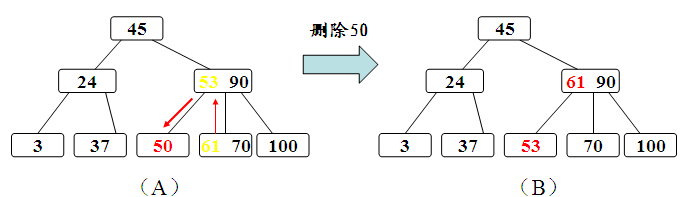
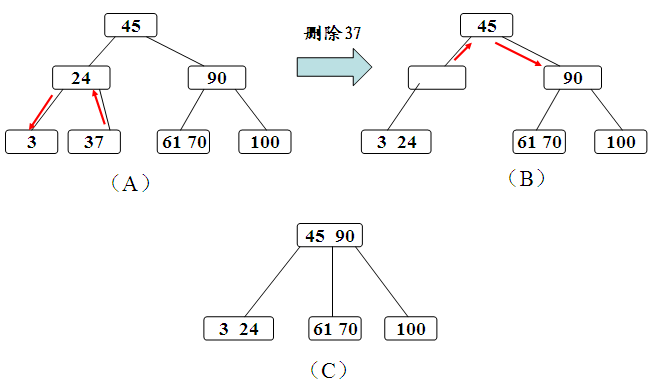

#### B树 ####

（有一点需要强调一下，B-树，即为B树，因为B树的英文名字叫B-tree，所以。。。感觉是有人翻译得太智障）

B树是为磁盘或其他直接存取的辅助存储设备（RAM是主要存储设备，所以也叫做主存）而设计的一种平衡树。B树类似于红黑树，但它们在降低磁盘I/O操作数方面要更好一些。B树与红黑树的不同之处在于B树的节点可以有很多孩子，从数个到数千个。所以B树的严格高度可能比一棵红黑树要小很多（同样是 $\lg{n}$ ，B树的底数较大）。

在一个典型的B树应用中，所要处理的数据量非常大，以至于所有数据无法一次装入主存。B树算法将所需页面从磁盘复制到主存，然后修改过的页面写回磁盘（B树的节点即为读写对象）。在任何时刻，B树算法都只需在主存中保存一定的页面。因此，主存的大小并不限制B树的大小。

B树具有以下性质，假设是B树是 $m$ 阶的：

1. 每个结点至多拥有 $m$ 棵子树；
2. 根结点至少拥有两颗子树（存在子树的情况下，特殊情况：没有孩子的根结点，即根结点为叶子结点，整棵树只有一个根节点）
3. 除了根结点以外，其余每个分支结点至少拥有 m/2 棵子树；
4. 所有的叶结点都在同一层上；
5. 有 k 棵子树的分支结点则存在 k-1 个关键字，关键字按照递增次序进行排列；
6. 关键字数量需要满足$\lceil{m/2}\rceil -1 \leq  n \leq m-1$；

B树的搜素与二叉树的搜索相似。每个节点中包含 $k$ 个关键字（最多为 $m$ 个，且 $m$ 是固定的），将其儿子分为 $k+1$ 个区间，通过比较关键字与目标关键字的大小来确定其儿子节点或者确定是否找到目标节点。如果在叶子节点中仍然没有找到该关键字就放回NIL。（每个关键字相当于一个对象的属性，代表了一个要查询的对象，磁盘块中实际上存储的是对象集合）

假定对高度为h的m阶B树进行操作。

对于B树的插入操作，一般在第h层（叶子节点层）进行，通过搜索找到对应的结点进行插入根据即将插入的结点的数量又分为下面几种情况（如图）：

* 如果该结点的关键字个数没有到达m-1个，那么直接插入即可；
* 如果该结点的关键字个数已经到达了m-1个，那么根据B树的性质显然无法满足，需要将其进行分裂。分裂的规则是该结点（的所有关键字）**分裂**成两半（会生成一个新节点），将最中间的关键字进行提升，加入到父亲结点中（插入父节点中），但是这又可能存在父亲结点也满员的情况，则不得不向上进行回溯，甚至是要对根结点进行分裂，那么整棵树都加了一层。

对于B树的删除操作我们同样需要先通过搜索找到相应的值，存在则进行删除，需要考虑删除以后的情况：

- 如果该结点拥有关键字数量仍然满足B树性质，则不做任何处理；
- 如果该结点在删除关键字以后不满足B树的性质（关键字没有到达$\lceil{m/2}\rceil-1$的数量），则需要向兄弟结点借关键字，这又分为兄弟结点的关键字数量是否足够的情况。
  - 如果兄弟结点的关键字足够借给该结点，则过程为将父亲结点的关键字下移，兄弟结点的关键字上移；
  - 如果兄弟结点的关键字在借出去以后也无法满足情况，即之前兄弟结点的关键字的数量为$\lceil{m/2}\rceil-1$，借的一方的关键字数量为 $\lceil{m/2}\rceil-2$ 的情况，那么我们可以将该结点合并到兄弟结点中，合并之后的子结点数量少了一个，则需要将父亲结点的关键字下放，如果父亲结点不满足性质，则向上回溯；
- 其余情况参照BST中的删除。

> 到底什么要使用B树?
>
> 假设我们使用linux的直接IO写一个数据库。如果进行大量的IO操作的话，数据库操作的效率会非常地低。此时，我们使用B树作为数据结构。B 树中的每个结点根据实际情况可以包含大量的关键字信息和分支(当然是不能超过磁盘块的大小，根据块设备驱动的不同，一般块的大小在1k~4k左右)。要注意我们仅能保存一定的页面（或者块）在内存中，根节点一般保存在内存中。我们假设此时一个节点占据一个块的存储空间，可以有1000个孩子，那么一个高度为2的B树就可以存储100w的块。当我们需要查找某一个块时，因为可能有块存在磁盘中，我们最多只要进行两次磁盘IO就可以得到该块的内容。大大减少了磁盘IO的时间消耗。
>
> 在存取节点数据所耗时间远超过处理节点数据所耗时间的情况下，Ｂ树在可选的实现中拥有很多优势，因为存取节点的开销被分摊到里层节点的多次操作上。这通常出现在当节点存储在二级存储器如硬盘存储器上。通过最大化内部里层节点的子节点的数量，树的高度减小，存取节点的开销被缩减。另外，重新平衡树的动作也更少出现。

##### B+树 #####

由于B+树的数据都存储在叶子结点中，分支结点均为索引，方便扫库（遍历所有对象），只需要扫一遍叶子结点即可，但是B树因为其分支结点同样存储着数据，我们要找到具体的数据，需要进行一次中序遍历按序来扫，所以B+树更加适合在区间查询的情况，所以通常B+树用于数据库索引，而B树则常用于文件索引。

同样的，以一个m阶树为例：

1. 根结点只有一个，分支数量范围为[2，m]；
2. 分支结点，每个结点包含分支数范围为[$\lceil{m/2}\rceil$, m]；
3. 分支结点的关键字数量等于其子分支的数量减一，关键字的数量范围为[$\lceil{m/2 -1}\rceil$, m-1]，关键字顺序递增；
4. 所有叶子结点都在同一层；

其操作和B树的操作是类似的，不过需要注意的是，在增加值的时候，如果存在满员的情况，将选择结点中的值作为新的索引，还有在删除值的时候，索引中的关键字并不会删除，也不会存在父亲结点的关键字下沉的情况，因为那只是索引。

##### B树与B+树的区别 #####

这都是由于B+树和B具有这不同的存储结构所造成的区别，以一个m阶树为例。

1. 关键字的数量不同；B+树中分支结点有m个关键字，其叶子结点也有m个，其关键字只是起到了一个索引的作用，但是B树虽然也有m个子结点，但是其只拥有m-1个关键字。
2. 存储的位置不同；B+树中的数据都存储在叶子结点上，也就是其所有叶子结点的数据组合起来就是完整的数据，但是B树的数据存储在每一个结点中，并不仅仅存储在叶子结点上。
3. 分支结点的构造不同；B+树的分支结点仅仅存储着关键字信息和儿子的指针（**这里的指针指的是磁盘块的偏移量**），也就是说内部结点仅仅包含着索引信息。
4. 查询不同；B树在找到具体的数值以后，则结束，而B+树则需要通过索引找到叶子结点中的数据才结束，也就是说B+树的搜索过程中走了一条从根结点到叶子结点的路径。