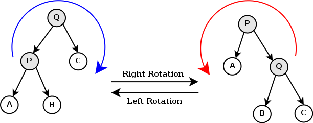

#### 二叉搜索树 #### 

二叉搜索树是一棵物理上的二叉树，需要一些额外的字节来维护每个节点的左右孩子的信息（至少两个指针，还可以维护父节点的信息）。二叉查找树（英语：Binary Search Tree），也称二叉搜索树、有序二叉树（英语：ordered binary tree），排序二叉树（英语：sorted binary tree），是指一棵空树或者具有下列性质的二叉树：

- 若任意节点的左子树不空，则左子树上所有节点的值均小于它的根节点的值；
- 若任意节点的右子树不空，则右子树上所有节点的值均大于它的根节点的值；
- 任意节点的左、右子树也分别为二叉查找树；
- **没有键值相等的节点**。

二叉搜索树对于查找和插入操作都具有较好的时间复杂度。当我们在有序数组上查找时，最快的方法是使用二分查找，它的复杂度是 O($\lg{n}$) ，而插入操作需要把每个大于或小于目标元素的元素向后移动，这导致了 O($n$) 的时间复杂度。而当我们在有序链表上操作时，我们虽然有 O(1) 的插入代价，但我们无法进行二分查找，因此查找的复杂度为 O($n$) 。而对于二叉树，无论查找和插入操作的时间复杂度都是 O($\lg{n}$)，所以对于需要经常使用查找和插入操作的场景下，二叉搜索树是一个不错的选择。

二叉树的查找算法，平均时间复杂度为 O($\lg{n}$)（准确来讲应该是O($\lg{h}$)，其中 $h$ 为树的高度）：

```
//T为要查找的二叉树，每个节点存储了一个value和左右子节点的信息left和right，没有子节点的话相应值为NIL
//T为空时T.root=NIL
//target为要查找的目标值
BST_search(T, target):
	position = T.root
	while position != NIL:
		if position.value < target:
			position = position.right
		else if position.value > target:
			position = position.left
		else:
			break
	return position	
```

由于二叉搜索树的查找和插入操作的最差时间复杂度取决于树的高度（即从根节点到一叶子节点的最长路径），而树的高度可能为n，所以最坏时间复杂度为 O($n$)，此时树中的每层都只有一个节点。插入操作如下：

```
//T为要查找的二叉树，每个节点存储了一个value和左右子节点的信息left和right，没有子节点的话相应值为NIL
//target为要插入的目标值
BST_insert(T, target):
	node = T.root
	if T.root == NIL:
		node = T.root = new node
		node.value = target
		node.left = node.right = NIL
		node.parent = NIL
	else:
		parent = T.root
		position = parent
		while position != NIL:            //每个插入都会成为二叉树的叶子节点!!
			parent = positon
			if parent.value < target:
				position = parent.right
			else if parent.value > target:
				position = parent.left
			else:
				return NULL               //该值已存在
		if parent.left == position:
			node = parent.left = new node
			node.value = target
			node.left = node.right = NIL
			node.parent = parent
		else:
			node = parent.right = new node
			node.value = target
			node.left = node.right = NIL
			node.parent = parent
	return node
```

删除操作如下（我们可以发现只有当node至少存在一个NIL儿子的时候才会被**实际删除**，其他情况下只是简单的将其左子树的最右节点或右子树的最左节点的value赋给node，然后删除最左/右节点）：

```
//T为要查找的二叉树，每个节点存储了一个value和左右子节点的信息left和right，没有子节点的话相应值为NIL
//node为要删除的节点
//有两种方法，一种是使左子树的最右节点成为新的node，另一种方法是使右子树的最左节点成为新的node
//两者分别对应中序遍历的前驱和后继
//这里采用第一种
BST_delete(T, node):
	parent = node.parent
	if node.right == NIL and node.left == NIL:
		if parent == NIL:             //删除的是根节点
        	T.root = NIL
        else if node == parent.left:
        	parent.left = NIL
        else:
        	parent.right = NIL
		delete node                   //如果为叶子节点就直接删除
	else if node.right == NIL:
		node.left.parent = node.parent       //如果没有右儿子，就删除node，用左儿子代替
		if node == node.parent.left:
			node.parent.left = node.left
		else:
			node.parent.right = node.left
		delete node
	else if node.left == NIL:
		node.right.parent = node.parent      //如果没有左儿子，就删除node，用右儿子代替
		if node == node.parent.left:
			node.parent.left = node.right
		else:
			node.parent.right = node.right
		delete node
	else:
		right_n = node.left
		p = node
		while right_n.right != NIL:   //找到左子树的最右节点，最右节点肯定没有右儿子
			p = right_n
			right_n = right_n.right
		node.value = right_n.value    //没有实际删除node
		if p == node:                 //左子树最右节点就是node的左儿子
			p.left = right_n.left     //最右节点被其左儿子替代
		else:
			p.right = right_n.left
		if right_n.left != NIL:       //最右节点是叶子节点
			right_n.left.parent = p
		delete right_n                //最右节点被实际删除
```

删除操作的时间复杂度也为 O($\lg{n}$)。

我们可以在每个节点中维护更多的信息来达到其他的需求（比如说以该节点为根的BST子树的节点数目），它们仅仅增加了 insert 和 delete 时间复杂度中的常数系数。

*******************

为了解决由于不平衡的树造成的效率低下的影响，**平衡树**（balanced tree）被开发出来以保证BST的效率。平衡树中，任何节点的两个子树的高度最大差别为1（每棵平衡树的高度不一定是 $\log{n +1}$ ，即不一定是一棵完全二叉树，其最少节点数目满足以下规律：$N_0=0,N_1=1,N_2=2; N_h=N_{h−1}+N_{h−2}+1$ 其中 $h$ 为树的高度，完全二叉树的定义见 documents/heap/heap.md ）几乎所有平衡树的操作都基于 O(1) 的**旋转**操作，通过旋转操作可以使树趋于平衡。旋转操作不会违背BST的性质。（旋转的时候注意要将旋转的两个节点的所有儿子画出来，如果没有左儿子或右儿子，用NIL节点代替，不然很容易搞错）

旋转操作如图：

```
//N为旋转后变为父元素的节点（转轴），在途中分别为P（右旋）和Q（左旋），N.parent指向父节点
//T为节点所属二叉树，T.root.parent指向NIL
left_rotation(T, N):
	if N != T.root:           //如果N是根节点，那么什么都不做
		parent = N.parent
		grandparent = parent.parent
		if grandparent != NIL:
			if grandparent.left == parent:
				grandparent.left = N
			else:
				grandparent.right = N
		else:
			T.root = N        //如果parent是根节点那么要重设根节点
		N.parent = grandparent
		parent.parent = N
		parent.right = N.left
		if N.left != NIL:     // !
			N.left.parent = parent   
		N.left = parent

//右旋与左旋类似
right_rotation(T, N):
	if N != T.root:
		parent = N.parent
		grandparent = parent.parent
		if grandparent != NIL:
			if grandparent.left == parent:
				grandparent.left = N
			else:
				grandparent.right = N
		else:
			T.root = N
		N.parent = grandparent
		parent.parent = N
		parent.left = N.right
		if N.right != NIL:
			N.right.parent = parent
		N.right = parent
```

通常我们采用旋转操作来使子树的高度减1（我们把PABCQ视为一棵子树，假设此时以P节点为根的子树高度等于以C节点为根的子树高度加2），但我们需要注意到，如果需要右旋时（如图），B节点代表的子树高度如果等于A节点代表的子树高度加1，此时右旋后仍不平衡，我们需要先左旋P和B节点，再右旋B和Q节点（double rotation），左旋时情况类似。

每种平衡树的搜索方式和普通BST相同，我们只关注它们的 insert 和 delete 操作。

##### AVL #####

AVL树是最先发现的自平衡查找树，在AVL树中任何节点的两个子树的高度最大差别为1，也被称为高度平衡树。AVL树的**每个节点中都保存了该节点在树中的高度**（height，即从该节点到其子树中一叶子节点的最长简单路径），我们可以很简单地得到：每个节点（node）的高度等于以其为根节点的树的高度并等于两儿子节点的高度的最大值加1（ node.height = max{ node.left.height, node.right.height } + 1 ）。根据这个公式，为了方便计算，我们将NIL节点的 height 记为 -1（ NIL.height=-1 ）。

根据AVL树的定义可得，|node.left.height - node.right.height|必须满足 <= 1。

在AVL树的 insert 操作中，和之前的 BST_insert 一样，我们首先找到合适的位置并插入一个新的节点（新节点的高度为0），然后更新每个需要更新的节点的 height。通过每个节点的 height，如果插入后树不再是平衡的，我们找到第一个不平衡的节点进行一些旋转使其重新平衡（平衡之后不平衡节点往上的节点都是平衡的，**旋转消除了插入节点后不平衡子树的根节点上方节点高度的变化**）。并且旋转之后只需要更新旋转操作的两个节点的高度。

插入节点时分为4种情况（左、右的double rotation和一次旋转），四种情况对应的旋转方法是不同的，复杂度为 O($\lg{n}$)

```
//T为要插入的二叉树，每个节点存储了一个value和左右子节点的信息left和right，没有子节点的话相应值为NIL
//target为要插入的目标值，NIL的height为-1
AVL_insert(T, target):
	node = BST_insert(T, target)       //假设BST_insert返回插入的节点
	node.height = 0                    //插入节点的height为0
	parent = node.parent
	while parent != NIL:			   //沿插入节点的父节点向上查找不平衡的树的根节点
		if parent.left.height-parent.right.height == 2:  
			if node.right.height-node.left.height == 1:  //double rotation
				left_rotation(node.right)                //旋转之后node.right成为父元素
				update the height of node and node.right
				right_rotation(parent.left)
				update the height of parent and parent.parent  //parent.left成为父元素
			else:
				right_rotation(node)
				update the height of node and parent
			break                                       // !
		else if parent.left.height-parent.right.height == -2:
			if node.right.height-node.left.height == -1: //double rotation
				right_rotation(node.left)
				update the height of node and node.left
				left_rotation(parent.right)
				update the height of parent and parent.parent  //parent.right成为父元素
			else:
				left_rotation(node)
				update the height of node and parent
			break                                       // !
		parent.height = max(parent.left.height, parent.right.height)+1
		node = parent
		parent = parent.parent
```

从AVL树中删除，同样先与普通BST中一样删除节点，然后**从实际删除的节点的父节点开始**向上更新height和查找不平衡节点修正平衡（也有可能出现需要 double rotation 的情况），比较麻烦的是确定实际被删除的节点的位置（其实应该结合 BST_search 写，更新 height 更加方便），复杂度也为 O($\lg{n}$)：

```
//最好结合在BST_delete中写。。。
//这里为了直观的看到普通BST操作和AVL树操作的区别和联系分开写了，常数系数会大一些
AVL_delete(T, target):
	node = BST_search(T, target)
	if node != NIL:
		parent = NIL
		if node.right == NIL or node.left == NIL: 
			parent = node.parent            //实际被删除的节点为node节点
		else:
			right_n = node.left
			while right_n.right != NIL:     //找到node左子树的最右节点
				right_n = right_n.right
			parent = right_n.parent         //最右节点会被实际删除   
		BST_delete(T, node)        			//不返回值，此时BST_delete没有更新height
		while parent != NIL                 //沿引起高度变化位置向上查找不平衡的树的根节点
			if parent.left.height-parent.right.height == 2:
            	node = parent.left
				if node.right.height-node.left.height == 1:  //double rotation
					left_rotation(node.right)               
					update the height of node and node.right
					right_rotation(parent.left)
					update the height of parent and parent.parent 
				else:
					right_rotation(node)
					update the height of node and parent
				break                                       // !
			else if parent.left.height-parent.right.height == -2:
				node = parent.right
				if node.right.height-node.left.height == -1: //double rotation
					right_rotation(node.left)
					update the height of node and node.left
					left_rotation(parent.right)
					update the height of parent and parent.parent
				else:
					left_rotation(node)
					update the height of node and parent
				break                                       // !
			parent.height = max(parent.left.height, parent.right.height)+1
			parent = parent.parent
```

##### 红黑树 #####

红黑树（Red-black tree）也是一种自平衡二叉树。常用来构造关联数组和集合。在普通二叉树的基础上，它增加了如下的额外要求（性质）：

- 节点是红色或黑色。
- 根是黑色。
- 所有叶子都是黑色（*叶子是NIL节点*，NIL节点总为黑色）。
- 每个红色节点必须有两个黑色的子节点。（从每个叶子到根的所有路径上不能有两个连续的红色节点。）
- 从任一节点到其每个叶子的所有简单路径都包含相同数目的黑色节点。

与AVL树在每个节点中维护了该节点的高度信息不同，红黑树在每个节点中维护了其颜色信息，每个节点的颜色只能为 RED 或 BLACK 。这些额外要求确保了红黑树的关键特性：**从根到叶子的最长可能路径不多于最短可能路径的两倍长**。因为第四个要求保证了一条路径上不能有两个连续的红色节点，结合第五个要求我们可以得到可能的最短路径都是黑色节点，可能的最长路径有交替的红色和黑色节点，也就保证了没有路径能多于任何其他路径的两倍长。结果是，这个树大致上是平衡的（不一定是平衡的）。

红黑树上的只读操作和普通 BST 上的操作相同。我们同样只关注插入和删除操作。每次插入和删除操作可能会破坏红黑树的性质，恢复其性质需要时间复杂度为 O($\lg{n}$) 的颜色变更操作和**不超过三次**的旋转操作（对于插入操作是两次）。

当我们插入一个新节点时，第一步与一般 BST 上的操作相同，我们以 BST_insert 插入一个节点并把它标记为 **红色**（如果设为黑色，就会导致根到叶子的路径中有一条路径上多出一个额外的黑节点，这个是很难调整的。但是设为红色节点后，只可能会导致出现两个连续红色节点的冲突，那么可以通过颜色调换（color flips）和旋转操作来调整）下面要进行什么操作取决于临近节点的颜色。共有4种情况（我们**仅考虑插入节点的父节点是祖父节点的左儿子的情况**，右儿子的情况是对称的）：

1. 当插入节点成为根节点时，破坏了性质2，将节点的颜色改成 BLACK 就行了。
2. 当插入节点的父节点为黑色时，没有破坏任何性质。（包括了父节点是根节点的情况）
3. 当插入节点的父节点为红色（祖父节点的颜色肯定是黑色并且不是NIL），**插入节点是父节点的左儿子且叔父节点的颜色是黑色时**，此时性质4遭到破坏（因为**NIL为黑色且NIL颜色不能改变**，不能改变插入元素的兄弟节点和叔父节点的颜色，此时因为不确定其是否是NIL，只能改变插入节点、父节点和祖父节点的颜色），为了维持性质4并且不破坏性质5，将祖父节点的颜色改成红色，将父节点的颜色改成黑色，并右旋父节点。
4. 当插入节点的父节点为红色，**插入节点是父节点的右儿子且叔父节点为黑色时**，先左旋插入节点，再将此时的插入节点的颜色改成黑色，将此时插入节点的父节点（左旋操作执行之前的祖父节点）的颜色改成红色，并右旋插入节点。（即需要 double rotation）
5. 当插入节点的父节点为红色且**叔父节点的颜色为红色**（此时叔父节点肯定不是NIL，可以改变其颜色）时，将父节点和叔父节点的颜色改成黑色，将祖父节点颜色改成红色。因为在祖父节点位置的节点颜色变成了红色，将祖父节点视为新插入的节点递归向上处理祖父节点。

```
//T为要查找的二叉树，每个节点存储了一个value和左右子节点的信息left和right，没有子节点的话相应值为NIL
//target为要插入的目标值，NIL的color为BLACK
RBT_insert(T, target):
	node = BST_insert(T, target)    			  //BST_insert返回插入的节点
	node.color = RED                              //插入节点的color为RED
	while TRUE:
		if node == T.root:                        //插入节点成为根节点
			node.color = BLACK
			break
		parent = node.parent
		if parent.color == BLACK:                 //插入节点的父节点为BLACK
			break
		grandparent = parent.parent
		if parent == grandparent.left:            //插入节点的父节点是祖父节点的左儿子
			uncle = grandparent.right
			if parent.color == RED:               //父节点为RED，祖父节点肯定为BLACK
				if uncle.color == RED:            //叔父节点为RED
					parent.color = uncle.color = BLACK
					grandparent.color = RED
					node = grandparent
				else:                             //叔父节点为BLACK
					if node == parent.right:      //插入节点为父节点的右儿子
						left_rotation(node)       //double rotation
						node.color = BLACK
						grandparent.color = RED
						right_rotation(node)
					else:                         //插入节点为父节点的左儿子
						parent.color = BLACK
						grandparent.color = RED
						right_rotation(parent)
					break
		else:                                     //插入节点的父节点是祖父节点的右儿子
												  //与上面对称
			uncle = grandparent.left
			if parent.color == RED:               //父节点为RED，祖父节点肯定为BLACK
				if uncle.color == RED:            //叔父节点为RED
					parent.color = uncle.color = BLACK
					grandparent.color = RED
					node = grandparent
				else:                             //叔父节点为BLACK
					if node == parent.left:       //插入节点为父节点的右儿子
						right_rotation(node)      //double rotation
						node.color = BLACK
						grandparent.color = RED
						left_rotation(node)
					else:                         //插入节点为父节点的左儿子
						parent.color = BLACK
						grandparent.color = RED
						left_rotation(parent)
					break
```

红黑树的插入操作时间复杂度和 BST 中一样为 O($\lg{n}$)。

红黑树的删除操作（好麻烦...），我们观察 BST_delete 可以发现，当目标节点有两个儿子时，我们只是找到其左子树的最右节点或右子树的最左节点并简单将其value赋给目标节点，然后删除最左（右）节点，但没有改变目标节点的属性（颜色）。**问题实质上可以转化成删除最多只有一个非NIL儿子的节点的问题**，并且当实际删除的节点存在一个非NIL儿子时，这个儿子的颜色一定为红色（因为如果一个儿子不是NIL而是非NIL黑色节点，另一个为NIL，那么就存在不同黑色节点数目的路径，不符合性质5）：

1. 当实际删除的节点是红色时（其两个儿子一定为NIL），不会破坏任何一条性质，直接删除，并用NIL代替。

2. 当实际删除的节点是黑色并存在一个非NIL儿子时，其非NIL儿子一定为红色，此时简单的将其红色儿子的颜色重绘成黑色并顶替删除的节点即可。

3. 当实际删除的节点是黑色且不存在任何非NIL儿子时，这时的情况比较复杂，因为删除它会引起路径上黑色节点数目的变化，破坏了性质5，我们用 NIL 代替该节点表示该节点已删除，称该 NIL 节点为 N，N的父节点为 P，N的兄弟节点为 S，S的右儿子为 Sr，S的左儿子为 Sl 。此时因为删除了一个节点，从 P 上方经过 N 的路径上的黑色节点数目比经过 S（也就是Sl 和 Sr） 的路径少1（如果 S 存在的话），我们需要平衡这两种路径（我们只讨论该节点是其父节点的左儿子的情况，右儿子的情况是对称的）：
   1. 当实际删除的节点是根节点时，直接删除即可。

   2. **当 Sr 为红色时（S 的颜色肯定为黑色，无论 P 是什么颜色）**只需要互换 P 和 S 的颜色，并将 Sr 置为黑色，然后左旋 S 即可满足要求。因为左旋 S 使经过 Sr 的路径上的黑色节点数目减少了1，将 Sr 置为黑色可以补充该路径上的减少量，而 Sl 成为了 P 的右儿子，P 此时变成了黑色，所以经过 Sl 的路径的黑色节点数目没有变化。此时，经过 Sl 和 Sr 的路径上的黑色节点数目没有变化而经过 N 的路径上的黑色节点数目成功加 1。满足需求。

   3. **当 Sl 为红色时（S 的颜色肯定为黑色，无论 P 是什么颜色）**，此时可以右旋 Sl ，交换 S 和 Sl 的颜色（因为 S 为黑色，Sr 此时肯定为黑色），处理后变成了第2种情况。然后按照第2种情况进行处理。（如果 Sl 和 Sr 都为红色则直接按照第3种情况处理）

   4. **当 P 的颜色为红色（S 的颜色肯定为黑色）且 Sl 和 Sr 都为黑色时**，将 P 和 S 的颜色互换即可在不改变经过 S 的路径上黑色节点数目的条件下使经过 N 的路径上黑色节点数目加1。

   5. **当 P 的颜色为黑色且 S 的颜色为红色时**，Sl 和 Sr 一定是黑色非NIL节点，（因为 Sl 和 Sr 可能有红色子节点，不能简单将 Sl 和 Sr 置为红色）此时将 P 与 S 的颜色互换，并左旋 S，处理后 Sl 变成了新的 S ，（新的 S 为黑色，P 为红色）。然后看是2、3、4哪种情况再进行处理。

   6. **当 P 的颜色为黑色， S 和 Sl 、Sr 都为黑色时**，此时将 S 置为红色，这样平衡了经过 N 和 S 的路径，但又导致了经过 P 的路径上黑色节点数目比不经过 P 的路径少1，所以需要再将 P 视为新的的 N 节点递归向上进行处理。

      > PS：实际是只要记住 Sr 为红色和 Sl 为红色都是特殊情况就可以了，其他情况可以推出来


删除代码如下，比较麻烦的是我们需要确定取代实际被删除节点的节点，也就是 N 的位置：

```
//最好结合在BST_delete中写。。。
//这里为了直观的看到普通BST操作和红黑树操作的区别和联系分开写了，常数系数会大一些
RBT_delete(T, target):
	node = BST_search(T, target)
	if node != NIL:
		N = NIL                           
		delete_color = node.color             //保存实际删除节点的颜色
		if node.right == NIL and node.left == NIL:
			N = NIL                           //node两儿子都为NIL
		else if node.right == NIL:
			N = node.left                     //node被左儿子代替
        else if node.left == NIL:
			N = node.right                    //node被右儿子代替
		else:
			right_n = node.left
			while right_n.right != NIL:       //找到node左子树的最右节点
				right_n = right_n.right
			N = right_n.left                  //最右节点会被实际删除，并被其左儿子替代
			delete_color = right_n.color
        BST_delete(T, node)        			  //不返回值，BST_delete没有进行任何颜色操作
        
        if delete_color == RED:               //被删除的节点的颜色为红色时
        	pass
        else if N.color == RED:               //被删除的节点的颜色为黑色，且有一个非NIL儿子时
        	N.color = BLACK
        else:
        	P = N.parent
        	while TRUE:
        		if P == NIL:                  //被实际删除的节点是根节点
        			break
        		if N == P.left:
        			S = P.right
        			Sl = S.left
        			Sr = S.right
        			if Sr.color == RED:       //Sr颜色为红色时
        				swap(S.color, P.color)
        				left_rotation(S)
        				Sr.color = BLACK
        				break                 // !
        			else if Sl.color == RED:  //Sl颜色为红色且Sr颜色不为红色时
        				right_rotation(Sl)
        				Sl.color = BLACK
        				S.color = RED
        			else if P.color == RED:   //P为红色且Sl和Sr均为黑色时
        				P.color = BLACK
        				S.color = RED
        				break                 // !
        			else if P.color == BLACK and S.color == RED:
        				S.color = BLACK       //P为黑色且S为红色时
        				P.color = RED
        				left_rotation(S)
        			else if P.color == BLACK and S.color == BLACK
        				S.color = red         //P为黑色且S、Sl、Sr均为黑色时
        				N = P                 //递归向上处理
        		
        		else：                        //与上面对称
        			S = P.left
        			Sl = S.left
        			Sr = S.right
        			if Sl.color == RED:       //Sl颜色为红色时
        				swap(S.color, P.color)
        				right_rotation(S)
        				Sl.color = BLACK
        				break                 // !
        			else if Sr.color == RED:  //Sr颜色为红色且Sl颜色不为红色时
        				left_rotation(Sr)
        				Sr.color = BLACK
        				S.color = RED
        			else if P.color == RED:   //P为红色且Sl和Sr均为黑色时
        				P.color = BLACK
        				S.color = RED
        				break                 // !
        			else if P.color == BLACK and S.color == RED:
        				S.color = BLACK       //P为黑色且S为红色时
        				P.color = RED
        				right_rotation(S)
        			else if P.color == BLACK and S.color == BLACK
        				S.color = red         //P为黑色且S、Sl、Sr均为黑色时
        				N = P                 //递归向上处理
```

红黑树的删除操作的时间复杂度也为 O($\lg{n}$)。但红黑树的统计性能比AVL树更高，因为AVL是严格的平衡树，在增加或删除节点时，根据不同的情况，旋转的次数比红黑树更多，**红黑树用非严格的平衡换取了增删节点的较少旋转次数**，如果搜索的次数远远大于插入和删除的次数，那么应该选择AVL树。而且在多线程环境中，一次旋转需要锁住整个树，所以红黑树对于多线程更加友好。


*参考内容：*

[维基百科：红黑树]: https://zh.wikipedia.org/wiki/%E7%BA%A2%E9%BB%91%E6%A0%91
[维基百科：AVL树]: https://zh.wikipedia.org/wiki/AVL%E6%A0%91

